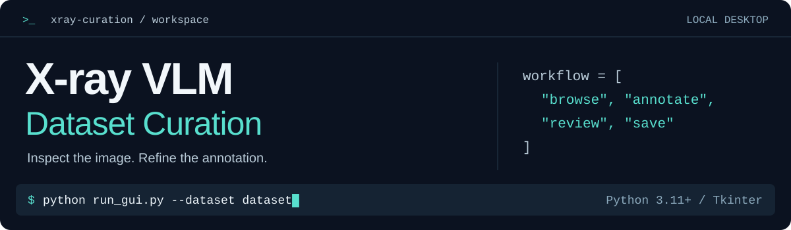
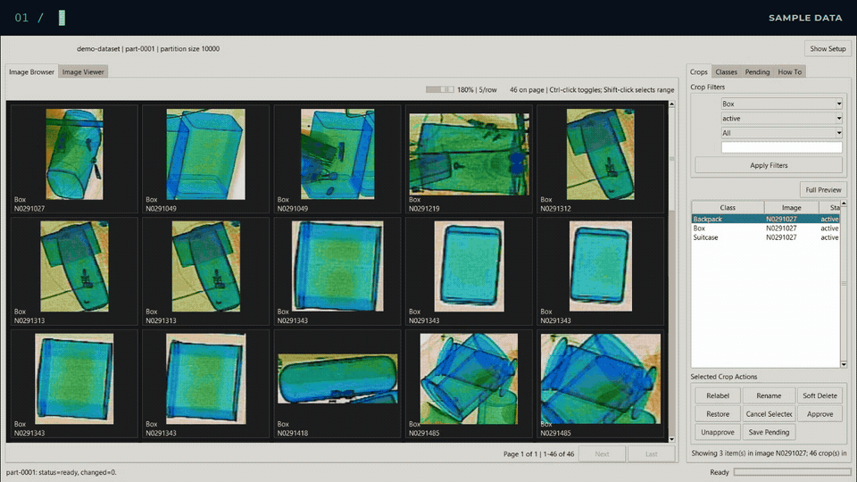
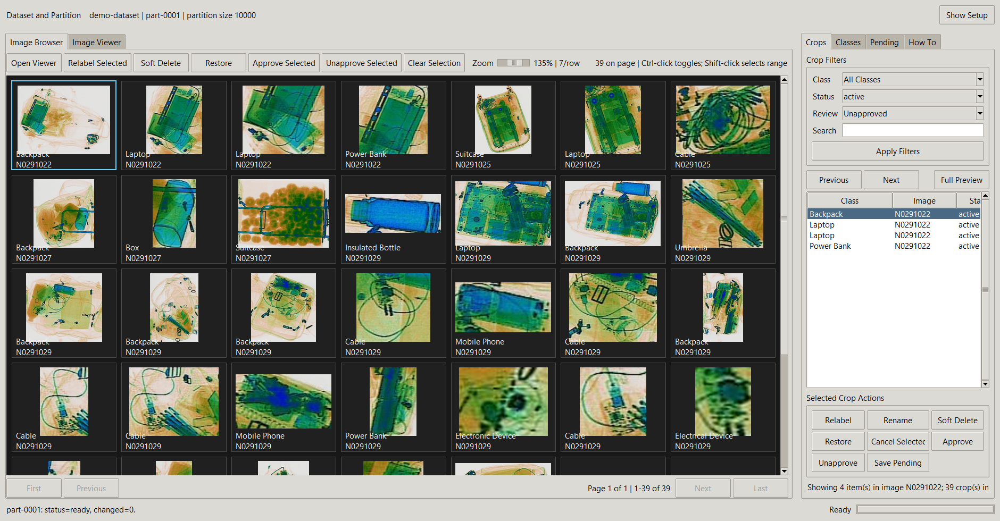
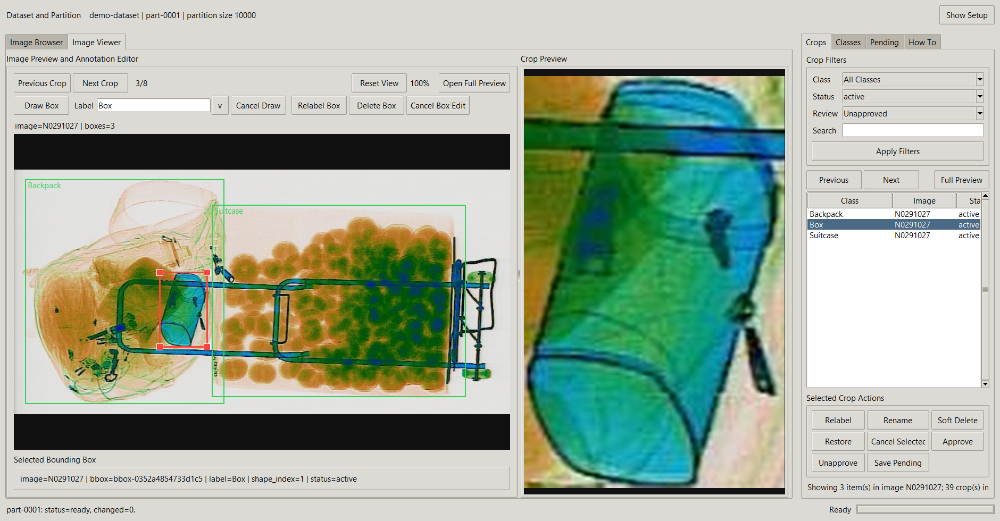
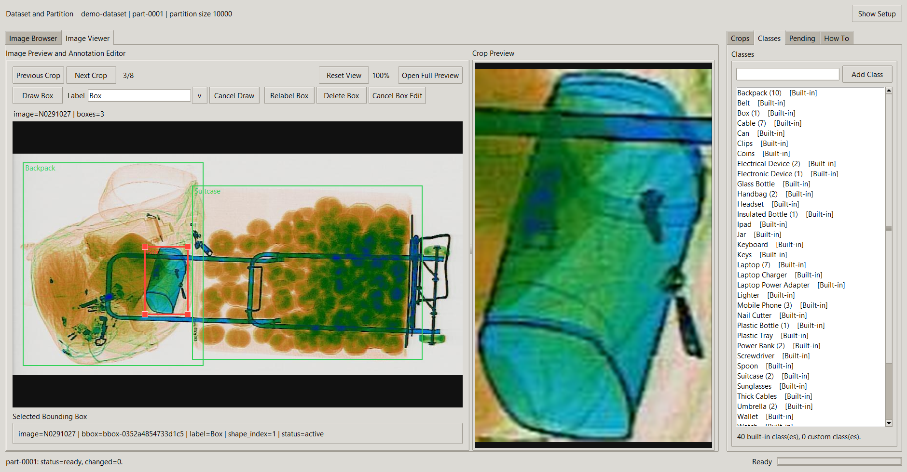
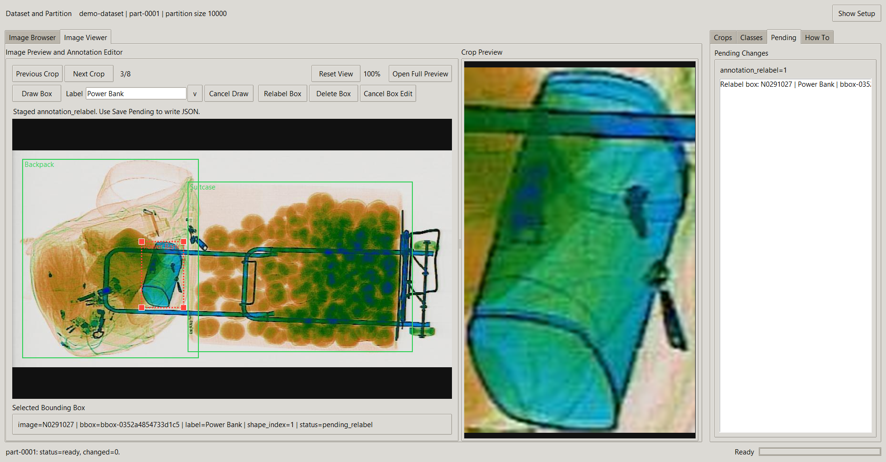

<h1 align="center">X-ray VLM Dataset Curation</h1>

<p align="center">
  
</p>

<p align="center">
  <strong>One workspace for images, bounding boxes, and crop review.</strong><br>
  A local desktop workflow for X-ray VLM and object-detection datasets.
</p>

<p align="center">
  <code>Python 3.11+</code> &nbsp; <code>Tkinter + Pillow</code> &nbsp; <code>Windows</code>
</p>

<p align="center">
  <a href="#quick-start">Quick start</a> &nbsp;·&nbsp;
  <a href="#see-it-in-action">Watch the demo</a> &nbsp;·&nbsp;
  <a href="docs/gui-guide.md">Workflow guide</a> &nbsp;·&nbsp;
  <a href="#development">Development</a>
</p>

## See It in Action

**Browse → filter → approve → inspect → edit → save.** A 40-second walkthrough of the actual app, using a disposable 20-image dataset copy.

[](docs/images/gui-demo.mp4)

[Watch or download the sharper MP4](docs/images/gui-demo.mp4) · 40 seconds, silent · GIF 6.1 MB / MP4 5.5 MB · [View still screenshots](#gui-screenshots)

The demo starts in **Image Browser** with the **Box** class, scrolls through its crops, applies **Unapproved** (pending review), approves two batches, and shows the six **Approved** crops in the same class. It then opens a linked image, zooms in, resizes a box, reviews the pending edit, and saves. Original research files remain unchanged. [Capture notes](docs/images/README.md)

## GUI Screenshots

<details>
<summary>Explore four full-resolution screenshots</summary>

These are captures of the running Windows application using a temporary eight-image dataset copy. The examples show browsing, linked bounding boxes and crops, class management, and an unsaved annotation edit. Original dataset files were unchanged during capture.

### Image Browser

Browse crop thumbnails, filter by class/status/review progress, and select multiple items for batch review. Ctrl-click toggles individual items; Shift-click selects a range.



### Image Viewer and Annotation Editor

Inspect the source image with labeled bounding boxes alongside the selected crop. Draw, move, resize, relabel, or delete boxes, then review changes before saving.



### Class Management and Pending Changes

**Classes:** browse built-in labels and add dataset-specific custom classes.



**Pending:** inspect staged edits before using **Save Pending** or **Ctrl+S**. The example relabel below is staged for demonstration only.



</details>

[Screenshot capture notes](docs/images/README.md)

## Quick Start

Requires **Python 3.11+**, **Tkinter**, and a desktop display. Windows is the primary platform. Pillow and the other Python dependencies are installed with the package.

From the repository root, create an environment and install the app:

```powershell
python -m venv .venv
.\.venv\Scripts\python.exe -m pip install -e .
```

Place your local dataset in this layout, pairing each image with a LabelMe-style JSON annotation of the same stem:

```text
dataset/
  images/
    example.jpg
  json/
    example.json
```

Launch the GUI:

```powershell
.\.venv\Scripts\python.exe run_gui.py --dataset dataset
```

You can pass another dataset path, including an existing `batch_1` folder. The package entry point also works: `python -m xray_curation gui --dataset <path>` from an environment where the package is installed.

To experiment with the six tiny test images, first copy the fixture to a new local demo folder. Run the copy command once, then reuse the demo folder:

```powershell
New-Item -ItemType Directory -Path dataset -Force | Out-Null
Copy-Item -LiteralPath tests\fixtures\small_dataset -Destination dataset\demo -Recurse
.\.venv\Scripts\python.exe run_gui.py --dataset dataset\demo
```

Edits then affect the demo copy instead of the committed test fixtures. The fixture images are synthetic; the screenshots above use a separate X-ray dataset sample.

## Review Workflow

1. Choose the dataset root. An existing index loads automatically; use **Index Dataset** on first use or after the image/annotation set changes.
2. Select a partition, normally up to 10,000 images. Use **Generate Crops** the first time or **Resume** for existing crops.
3. Browse **Image Browser** and double-click a thumbnail to open **Image Viewer**. Source-image browsing also works before crop generation.
4. Inspect and edit bounding boxes or stage crop actions such as **Relabel**, **Rename**, **Soft Delete**, and **Restore**.
5. Review the **Pending** tab, then use **Save Pending** or **Ctrl+S**. Saved edits refresh crops for affected images when a crop manifest exists.
6. Use **Approve Selected** for completed reviews. Approval saves immediately and hides items from the default **Unapproved** filter; choose **All** or **Approved** to see them again.

In Image Viewer, crop selection opens the source context and highlights its box.
Repeated clicks cycle through overlapping boxes. Use **Draw Box** with an
approved formal label, drag to move or resize a box, or use **Relabel Box**,
**Delete Box**, and **Cancel Box Edit**. Saving performs affected-image-only crop refresh
when generated crops exist for the selected partition.

**Save behavior:** annotation JSON files are the source of truth and are written atomically. Original images remain unchanged. **Soft Delete** keeps a recoverable annotation and moves its crop into the soft-deleted group; **Delete Box** removes the annotation box when saved. Approval is stored separately from annotation edits.

See the [complete workflow guide](docs/gui-guide.md) for label management, zoom/pan, overlapping boxes, pending changes, refresh/rebuild behavior, and command-line utilities.

## Repository Layout

```text
X-ray_VLM_Dataset/
  run_gui.py                 Desktop launcher
  pyproject.toml             Package metadata and dependencies
  src/xray_curation/
    domain/                  Labels, identities, and operation models
    services/                Indexing, annotations, crop generation, and validation
    gui/                     Tkinter views, state, and worker helpers
    legacy/                  Legacy compatibility code
    cli.py                   Command-line entry points
  GUI_Dataset/               Compatibility launchers for older commands
  tests/
    unit/                    Focused service/model checks
    integration/             Fixture-based workflows
    fixtures/                Small committed test datasets
  docs/                      User and developer documentation
    images/                  README banner, demo, screenshots, and capture notes
  dataset/                   Local research data (Git-ignored)
```

The application creates derived state inside `<dataset>/curation/`: dataset and crop manifests, partition state, review progress, generated crops, and operation logs. Raw datasets and generated artifacts stay out of Git; the small test fixtures and documentation visuals are intentional exceptions.

## Documentation

- [GUI workflow guide](docs/gui-guide.md): detailed usage, save semantics, and CLI utilities.
- [GUI smoke tests](docs/gui-smoke-tests.md): manual regression checks.
- [Bounding-box identity](docs/bbox-identity.md): how annotations stay linked to crops.
- [Legacy migration notes](docs/legacy-migration.md) and [compatibility wrappers](GUI_Dataset/README.md).
- [Repository review](docs/repository-review.md): organization checks and outstanding housekeeping.

## Development

Install the development dependencies and run the suite:

```powershell
.\.venv\Scripts\python.exe -m pip install -e ".[dev]"
.\.venv\Scripts\python.exe -m pytest tests\unit tests\integration
.\.venv\Scripts\python.exe -m compileall -q src GUI_Dataset
```

Tests use small fixtures and synthetic manifests. Keep application logic in `src/xray_curation/`, keep `GUI_Dataset/` as compatibility wrappers, and use a fixture copy or a deliberately selected partition for manual testing.
